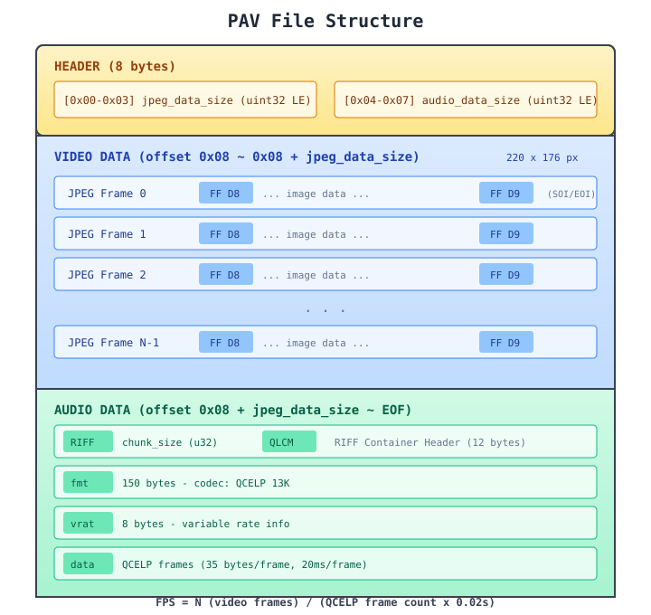
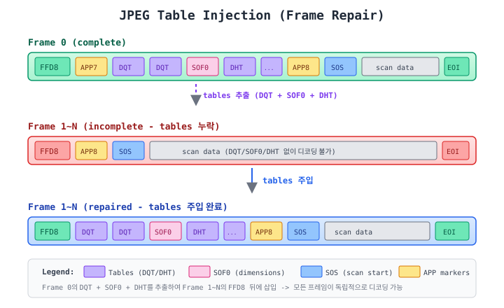
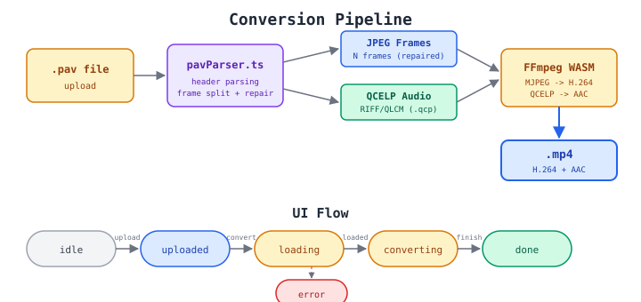

# PAV to MP4 Converter

> **배포 사이트**: https://pav-mp4-convert.theson.workers.dev/

2000년대 구형 휴대폰에서 촬영된 PAV 동영상 파일을 웹 브라우저에서 MP4로 변환하는 SPA(Single Page Application)입니다.

서버 업로드 없이 **브라우저 내에서 모든 변환이 완료**되며, FFmpeg WASM을 활용하여 H.264 비디오 + AAC 오디오가 포함된 MP4 파일을 생성합니다.

## 기술 스택

| 영역 | 기술 |
|------|------|
| 프레임워크 | React 19 + TypeScript |
| 빌드 도구 | Vite |
| 스타일링 | Tailwind CSS v4 |
| 영상 변환 | FFmpeg WASM (`@ffmpeg/ffmpeg` + `@ffmpeg/core`) |
| 테스트 | Vitest |

## 시작하기

```bash
# 의존성 설치
npm install

# 개발 서버 실행
npm run dev

# 빌드
npm run build

# 테스트
npx vitest run
```

## 주요 기능

1. **PAV 파일 업로드** - 드래그 앤 드롭 또는 클릭으로 파일 선택
2. **프레임 미리보기** - 업로드 즉시 첫 번째 프레임을 이미지로 표시하고 파일 정보(해상도, FPS, 길이) 출력
3. **실시간 변환** - 프로그레스 바와 FFmpeg 로그를 실시간 확인
4. **결과 미리보기 및 다운로드** - 변환된 MP4를 브라우저에서 바로 재생하고 다운로드

---

## PAV 파일 포맷 분석

PAV는 공개 명세가 존재하지 않는 독자적인 동영상 포맷입니다. 본 프로젝트에서는 샘플 파일의 바이너리를 리버스 엔지니어링하여 아래와 같은 구조를 파악했습니다.

### 전체 구조

<p align="center">
  
</p>

PAV 파일은 크게 세 영역으로 구성됩니다:

| 영역 | 오프셋 | 내용 |
|------|--------|------|
| **Header** | `0x00 ~ 0x07` | 8바이트. `jpeg_data_size`(u32 LE) + `audio_data_size`(u32 LE) |
| **Video** | `0x08 ~ 0x08 + jpeg_data_size` | JPEG 프레임이 연속으로 나열 (Motion JPEG) |
| **Audio** | 이후 ~ EOF | RIFF/QLCM 컨테이너에 담긴 QCELP 13K 오디오 |

### 비디오 영역

- 각 프레임은 JPEG SOI(`FF D8`) ~ EOI(`FF D9`) 마커로 구분
- 해상도: 220 x 176 (분석한 샘플 기준)
- FPS는 파일마다 상이 (~15fps 또는 ~7.5fps)
- **FPS 계산 공식**: `video_frame_count / (QCELP_frame_count x 0.02s)`

### 오디오 영역

- RIFF 컨테이너, 포맷 식별자 `QLCM`
- 코덱: QCELP 13K (Qualcomm Code Excited Linear Prediction)
- QCELP 프레임: full rate 기준 35 bytes/frame, 20ms/frame
- 하위 청크: `fmt ` (150 bytes) → `vrat` (8 bytes) → `data` (오디오 PCM)

### JPEG 프레임 테이블 공유 문제

PAV 파일의 가장 까다로운 특성은 **JPEG 테이블 공유**입니다.

첫 번째 프레임(Frame 0)에만 DQT(양자화 테이블), DHT(허프만 테이블), SOF0(프레임 헤더)가 포함되어 있고, 이후 프레임들은 이 테이블 없이 SOS(스캔 데이터)만 담고 있습니다.

따라서 Frame 1 이후의 프레임을 독립적인 JPEG으로 디코딩하려면 **Frame 0에서 테이블을 추출하여 각 프레임에 주입**해야 합니다.

<p align="center">
  
</p>

**프레임별 마커 비교:**

| 프레임 | 마커 시퀀스 |
|--------|------------|
| Frame 0 | `FFD8` → `APP7` → `DQT` → `DQT` → `SOF0` → `DHT x4` → `APP8` → `SOS` → data → `FFD9` |
| Frame 1~N | `FFD8` → `APP8` → `SOS` → data → `FFD9` (테이블 누락) |
| Frame 1~N (수정 후) | `FFD8` → **`DQT` → `DQT` → `SOF0` → `DHT x4`** → `APP8` → `SOS` → data → `FFD9` |

---

## 변환 파이프라인

<p align="center">
  
</p>

### 처리 단계

1. **PAV 파싱** (`pavParser.ts`)
   - 8바이트 헤더에서 비디오/오디오 영역 크기 파싱
   - `FFD8`/`FFD9` 마커로 개별 JPEG 프레임 분리
   - Frame 0에서 DQT + SOF0 + DHT 테이블 추출
   - Frame 1~N에 테이블 주입하여 독립 디코딩 가능한 JPEG으로 수정
   - RIFF/QLCM 오디오 데이터 추출
   - QCELP 프레임 카운트 기반 duration 및 FPS 계산

2. **FFmpeg WASM 변환** (`converter.ts`)
   - 수정된 JPEG 프레임들을 FFmpeg 가상 파일시스템에 연번 파일로 기록
   - QCELP 오디오를 `.qcp` 파일로 기록
   - `image2` 입력 + `libx264` 인코딩으로 H.264 비디오 생성
   - QCELP → AAC 오디오 트랜스코딩 (실패 시 비디오만 변환하는 fallback)
   - 결과 MP4를 Blob으로 반환

3. **UI 렌더링** (`App.tsx`)
   - 상태 머신: `idle` → `uploaded` → `loading` → `converting` → `done`
   - 변환 중 실시간 진행률 및 FFmpeg 로그 표시
   - 완료 후 브라우저 내 비디오 재생 및 MP4 다운로드

---

## 프로젝트 구조

```
src/
├── lib/
│   ├── pavParser.ts          # PAV 바이너리 파서 + JPEG 프레임 수리
│   ├── pavParser.test.ts     # PAV 파서 테스트 (Vitest)
│   └── converter.ts          # FFmpeg WASM 변환 로직
├── components/
│   ├── FileUpload.tsx         # 드래그앤드롭 파일 업로드
│   ├── FramePreview.tsx       # 첫 프레임 미리보기 + 파일 정보
│   ├── ConversionProgress.tsx # 프로그레스 바 + 실시간 로그
│   └── VideoPreview.tsx       # MP4 재생 + 다운로드 + 로그 모달
├── App.tsx                    # 메인 앱 (상태 관리)
├── main.tsx
└── index.css

docs/files/
├── pav-format.svg             # PAV 파일 구조 다이어그램
├── jpeg-table-injection.svg   # JPEG 테이블 주입 과정
└── conversion-pipeline.svg    # 변환 파이프라인 및 UI 흐름
```

## Vibe Coding

본 프로젝트는 **Vibe Coding**으로 제작되었습니다. [Claude Code](https://claude.com/claude-code) (Claude Opus 4.6)를 활용하여 PAV 바이너리 포맷 분석, 파서 구현, UI 컴포넌트, 테스트 코드, 문서 및 다이어그램 작성까지 전 과정을 AI와 협업하여 진행했습니다.

단, **FFmpeg WASM 로딩 부분(`ffmpeg.load`)은 작업자가 직접 개입**하여 수정했습니다. AI가 생성한 초기 코드에서 COEP 헤더 충돌 및 Vite의 ESM 모듈 가로채기 등의 이슈가 발생했고, [ffmpeg.wasm 공식 Usage 문서](https://ffmpegwasm.netlify.app/docs/getting-started/usage)를 참고하여 CDN 기반 `toBlobURL` 방식으로 직접 수정하여 해결했습니다.

## 라이선스

MIT
